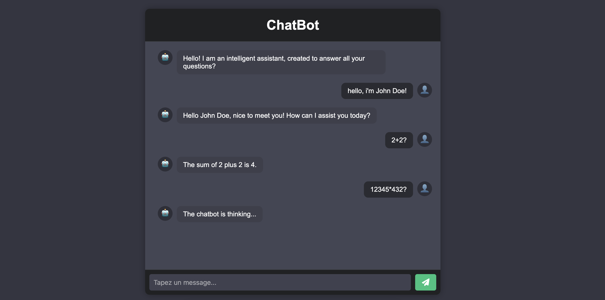

# LLM Web Chat with Ollama

A small test project to interact with open-source language models via [Ollama](https://ollama.com) and its API, using a simple Django-powered web interface.

---

## Installation

Start the Ollama server and run the project

```sh
# Create a virtual environment
python3 -m venv env

# Activate the environment (adjust for your OS)
source env/bin/activate

# Install dependencies
pip install -r requirements.txt

# Start the Django server
cd src/
python manage.py runserver
```

Then open http://127.0.0.1:8000/ in your browser to see the homepage.

---

## Requirements

Make sure you have the **mistral** open-source model installed with **Ollama**.

If not, install it here: https://ollama.com/library/mistral:latest

To use a different model, update the model name in `/src/app/views.py` at `line 44`, for example:

"model": "deepseek-r1"

---

## What This Project Includes

- A homepage (`/`)
- A chatbot interface (`/chat`)
- An API endpoint to interact with Ollama (`/api/chat`)
- Handles communication with http://localhost:11434/api/chat using the **mistral** model

Chat features:
- Chat history support
- A configurable context added to each conversation

Error handling:
- Detects when Ollama is not running
- Handles timeouts when the model takes too long to respond
- Disables message input while waiting for a response
- Displays error messages gracefully


## Screenshot

